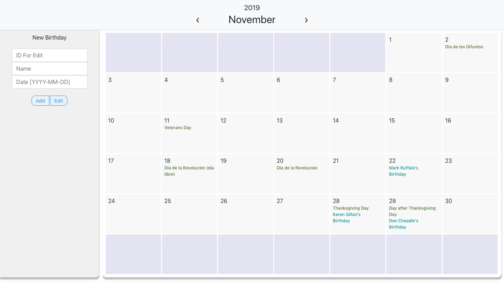
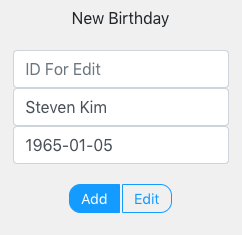
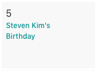
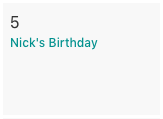
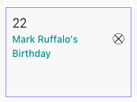

# Calander Project Based On MERN

This project was based on MERN and the entire goal of this group project was to recreate a calander with full CRUD(Create,Read,Update,and Delete) functionality. 

**Example App**

**Technologies Used**
- This project was bootstrapped with [Create React App](https://github.com/facebook/create-react-app).
- Heroku (API Deployment)
- Netlify (APP Deployment)
- Storybook (Component Library)
- Adobe XD (Wireframe/Planning)
- Jest (Testing)
---

**Features**

**Add A Birthday**

By entering a name and birthdate into the form on the left (no need to enter the ID when adding a new birthday), you can add your own birthday to the calendar!

---

**Edit A Birthday**

By entering the ID of the birthday you want to edit in the ID field of the form, you can change either the name or the date of that birthday.

---

**Delete A Birthday**

By hovering over a day that includes a birthday you can click the small (x) that appears to delete the birthday in the block.

---

**Getting Started**

- Find a project 

#### Looking for a project can be very daunting since. We decided on making a calendar because the layout and design of it is not complicated and we can focus on our API and crud functionality
- Create a wireframe

#### Creating a wireframe for this project is estential since there are so many componenets in a calendar. We created a wireframe using adobe XD. By doing this we learned how to create the perfect Grid template for this project. 

- Create a planning directory

#### The planning directory inculdes a list of models we used in the calendar as well as a picture of our entire wireframe.
---

**Working as a Group**

- Communication

##### Creating a fullstack MERN project from scartch is difficult as a team when without a plan As a group we needed to use the feature branch workflow so each person in the group can be as efficient as possible in making a calendar. We used an efficient workflow to split up the process and make time use very efficient.

-- Learning how to git pull effectively

#### Pulling fellow teammates code in the same file took a lot of learning as well as

**Links**
- [Deployed App](https://5dd8005397f25700083890c9--calanderproject.netlify.com/)
- [Github Repository](https://github.com/nickmckenney/calanderprojectMERN)
- [API URL](https://calendar-api-deploy.herokuapp.com/)
